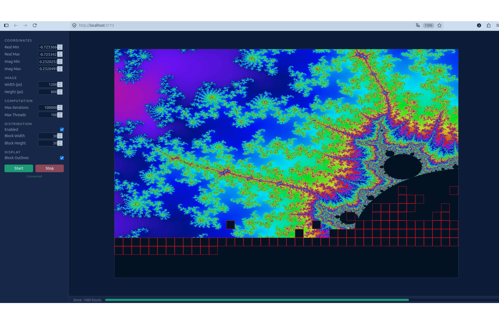

# Fractal Cluster

A distributed fractal renderer built with Go, gRPC, and React. Originally inspired by a VB6/COM+ demo from 1998 that showcased distributed computing across networked Windows machines, this project reimagines the same concept with a modern stack.



## Architecture

The system follows a coordinator/worker pattern. The browser connects via WebSocket to a coordinator, which splits the image into blocks and distributes them to workers over gRPC. Results stream back block-by-block, rendering progressively in the browser.

```
Browser (React + Canvas)
   |
   | WebSocket (JSON)
   |
Coordinator (Go)
   |
   | gRPC (Protobuf)
   |
 Workers (Go, n instances)
```

### Components

**Frontend** --- React, TypeScript, Vite, Canvas 2D

The UI sends calculation parameters (complex plane bounds, resolution, iteration depth) over a WebSocket connection. As the coordinator dispatches blocks, the frontend receives `block_started` events (red outlines showing parallelism) followed by `block_result` events (pixel data rendered via `putImageData`). Zoom is handled by mouse drag: left-click zooms in, right-click zooms out.

**Coordinator** --- Go, gorilla/websocket, gRPC

Receives calculation requests from the browser and orchestrates the computation:

1. **Splitter** divides the image into rectangular blocks (e.g. 30x30 px), merging remainder blocks that would be too small.
2. **Registry** accepts dynamic worker registrations. Workers register themselves on startup and send periodic heartbeats. The coordinator removes workers that miss their heartbeat timeout. Round-robin load balancing across all registered workers.
3. **Dispatcher** distributes blocks to registered workers with a semaphore controlling max concurrency. Failed blocks are retried up to 3 times on different workers.

The coordinator exposes two ports: HTTP (default 8080) for the frontend/WebSocket, and gRPC (default 9090) for worker registration.

**Worker** --- Go, gRPC

A stateless compute node. On startup, registers itself at the coordinator's gRPC endpoint and begins sending heartbeats every 10 seconds. Receives `ComputeRequest` messages (complex plane region, pixel dimensions, max iterations), computes the fractal, and returns an array of iteration counts. Workers parallelize internally across CPU cores. The fractal algorithm is pluggable via a registry; currently Mandelbrot is implemented.

### gRPC Protocol

Defined in [`proto/fractal.proto`](proto/fractal.proto):

| Service | RPC | Purpose |
|---------|-----|---------|
| FractalWorker | `Compute` | Compute iteration values for a rectangular block |
| FractalCoordinator | `Register` | Worker registers itself at the coordinator |
| FractalCoordinator | `Heartbeat` | Worker sends periodic heartbeat to stay registered |

### WebSocket Protocol

| Direction | Message | Purpose |
|-----------|---------|---------|
| Client -> Server | `start` | Begin calculation with params |
| Client -> Server | `stop` | Cancel running calculation |
| Server -> Client | `block_started` | Block dispatched to worker (triggers outline) |
| Server -> Client | `block_result` | Pixel data for completed block |
| Server -> Client | `progress` | Completed/total block count |

## Running

### Local

Start the coordinator, then one or more workers. Workers register themselves automatically:

```bash
make build
bin/coordinator -port 8080 -grpc-port 9090 -web web/dist &
bin/worker -port 50051 -coordinator localhost:9090 -advertise localhost:50051 &
bin/worker -port 50052 -coordinator localhost:9090 -advertise localhost:50052 &
```

No static worker configuration needed. Workers can be added or removed at any time.

Open http://localhost:8080 in a browser.

### Docker (optional, for distributed deployment)

```bash
docker compose -f docker/docker-compose.yaml up --build
```

This starts a coordinator and two workers. Workers register themselves at the coordinator via gRPC. Worker addresses are resolved via Docker DNS.

## Project Structure

```
cmd/
  coordinator/       Coordinator entry point
  worker/            Worker entry point
internal/
  coordinator/       WebSocket server, dispatcher, registry, splitter, gRPC registration
  worker/            gRPC server, self-registration (registrar)
  fractal/           Fractal algorithms (Mandelbrot) and calculator registry
  gen/fractal/       Generated protobuf/gRPC code
  protocol/          Shared WebSocket message types
proto/
  fractal.proto      gRPC service definition
web/
  src/
    components/      React components (Canvas, ParameterPanel, StatusBar)
    lib/             WebSocket client, canvas renderer, color table
docker/              Dockerfiles and compose (optional, for distributed deployment)
```

## 1998 vs 2026

| | VB6/COM+ (1998) | Go/gRPC/React (2026) |
|---|---|---|
| Compute nodes | COM+ objects on Windows machines | gRPC workers (any OS, containerized) |
| Communication | DCOM (binary, Windows-only) | gRPC + Protobuf (cross-platform, HTTP/2) |
| Service discovery | Static config on each machine | Workers self-register with heartbeat |
| Work distribution | Manual partitioning | Coordinator with round-robin, auto-failover, retry |
| Frontend | VB6 Forms, GDI | React + Canvas 2D, WebSocket streaming |
| Deployment | Install on each machine | `docker compose up` |
| Scaling | Add more Windows boxes | Add worker containers |
